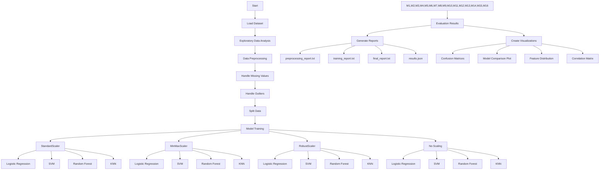

# Proyek Klasifikasi Diabetes

## Ringkasan
Proyek ini mengimplementasikan solusi machine learning untuk memprediksi diabetes menggunakan berbagai algoritma klasifikasi. Sistem ini menganalisis berbagai metrik kesehatan untuk memprediksi apakah seorang pasien menderita diabetes atau tidak.

## Dataset
Link: https://www.kaggle.com/datasets/shahnawaj9/diabetes-database
Dataset (`diabetes_Dataset_cleaned.csv`) berisi fitur-fitur berikut:
- Pregnancies: Jumlah kehamilan
- Glucose: Konsentrasi glukosa plasma
- BloodPressure: Tekanan darah diastolik (mm Hg)
- SkinThickness: Ketebalan lipatan kulit trisep (mm)
- Insulin: Insulin serum 2 jam (mu U/ml)
- BMI: Indeks massa tubuh (berat dalam kg/(tinggi dalam m)²)
- DiabetesPedigreeFunction: Fungsi riwayat diabetes dalam keluarga
- Age: Usia dalam tahun
- Outcome: Variabel kelas (0: Tidak diabetes, 1: Diabetes)

## Fitur-Fitur Pada 
1. **Analisis Data**
   - Visualisasi distribusi kelas
   - Analisis korelasi
   - Analisis kepentingan fitur
   - Analisis statistik fitur

2. **Pra-pemrosesan Data**
   - Deteksi dan penanganan pencilan (outlier)
   - Penskalaan fitur (StandardScaler, MinMaxScaler, RobustScaler)
   - SMOTE untuk menangani ketidakseimbangan kelas

3. **Rekayasa Fitur**
   - Fitur interaksi:
     * glucose_bmi: Glukosa × BMI
     * age_bmi: Usia × BMI
     * glucose_age: Glukosa × Usia
   - Fitur polinomial:
     * bmi_squared: BMI²
     * glucose_squared: Glukosa²
   - Fitur rasio:
     * glucose_per_bmi: Glukosa/BMI
     * insulin_per_glucose: Insulin/Glukosa

4. **Model yang Diimplementasikan**
   - K-Nearest Neighbors (KNN)
   - Support Vector Machine (SVM)
   - Regresi Logistik
   - Random Forest
   - Gradient Boosting

## File Output
- `class_distribution.png`: Visualisasi distribusi kelas diabetes
- `correlation_matrix.png`: Peta panas korelasi antar fitur
- `feature_outcome_relationships.png`: Plot kotak hubungan antara fitur dan diabetes
- `boxplot_before.png`: Distribusi fitur sebelum penanganan pencilan
- `boxplot_after.png`: Distribusi fitur setelah penanganan pencilan
- `feature_importance.png`: Peringkat kepentingan fitur
- Matriks kebingungan untuk setiap kombinasi model dan penskalaan

## Kebutuhan Sistem
```
pandas
numpy
scikit-learn
imbalanced-learn
matplotlib
seaborn
```

## Cara Penggunaan
1. Pastikan semua package yang diperlukan terinstal:
```bash
pip install pandas numpy scikit-learn imbalanced-learn matplotlib seaborn
```

2. Letakkan file dataset (`diabetes_Dataset_cleaned.csv`) di direktori yang sama dengan script.

3. Jalankan script:
```bash
python diabetesClasiffier.py
```

## Performa Model
Script mengevaluasi berbagai kombinasi dari:
- Metode penskalaan (Standard, MinMax, Robust, Tanpa penskalaan)
- Algoritma klasifikasi
- Setiap kombinasi menghasilkan:
  * Skor akurasi
  * Skor validasi silang
  * Matriks kebingungan
  * Laporan klasifikasi (presisi, recall, f1-score)

## Visualisasi
Proyek menghasilkan berbagai visualisasi untuk membantu memahami:
- Distribusi data
- Hubungan antar fitur
- Performa model
- Kepentingan fitur

## Catatan Penting
- Script menggunakan SMOTE untuk menangani ketidakseimbangan kelas
- Validasi silang dilakukan untuk memastikan evaluasi model yang robust
- Analisis kepentingan fitur membantu mengidentifikasi prediktor yang paling relevan
- Berbagai teknik penskalaan dibandingkan untuk menemukan pra-pemrosesan optimal

## Interpretasi Hasil
1. **Distribusi Kelas**:
   - Menunjukkan perbandingan jumlah pasien diabetes dan non-diabetes
   - Membantu memahami ketidakseimbangan dataset

2. **Korelasi Fitur**:
   - Menampilkan hubungan antar variabel
   - Membantu identifikasi fitur yang saling terkait

3. **Matriks Kebingungan**:
   - True Positive: Pasien diabetes yang tepat diprediksi
   - True Negative: Pasien non-diabetes yang tepat diprediksi
   - False Positive: Pasien non-diabetes yang salah diprediksi sebagai diabetes
   - False Negative: Pasien diabetes yang salah diprediksi sebagai non-diabetes

4. **Metrik Performa**:
   - Akurasi: Persentase prediksi yang benar
   - Presisi: Ketepatan prediksi positif
   - Recall: Kemampuan model mendeteksi kasus positif
   - F1-Score: Rata-rata harmonik presisi dan recall 

## Alur Kerja Program



## Struktur Output

Setiap kali program dijalankan, akan dibuat folder baru dengan format: `training_results/trainX_YYYYMMDD_HHMMSS/`

### Reports
- `dataset_report.txt`: Informasi dasar tentang dataset
- `eda_report.txt`: Hasil analisis eksploratori data
- `preprocessing_report.txt`: Laporan preprocessing data
- `training_report.txt`: Detail hasil training untuk setiap model
- `final_report.txt`: Ringkasan perbandingan semua model
- `results.json`: Hasil dalam format JSON

### Visualizations (dalam folder plots/)
1. Distribusi Data:
   - `class_distribution.png`
   - `feature_distribution.png`
   - `correlation_matrix.png`

2. Model Evaluation:
   - `model_comparison_with_scalers.png`
   - Confusion matrix untuk setiap kombinasi model dan scaler

## Fitur Program

1. **Data Loading & EDA**
   - Membaca dataset diabetes
   - Analisis distribusi kelas
   - Analisis korelasi antar fitur
   - Visualisasi distribusi fitur

2. **Preprocessing**
   - Penanganan missing values
   - Penanganan outliers menggunakan IQR
   - Train-test split dengan stratifikasi

3. **Model Training**
   - Implementasi 4 model:
     * Logistic Regression
     * Support Vector Machine (SVM)
     * Random Forest
     * K-Nearest Neighbors (KNN)
   - 4 teknik scaling:
     * StandardScaler
     * MinMaxScaler
     * RobustScaler
     * No Scaling
   - SMOTE untuk menangani imbalance

4. **Evaluation**
   - Accuracy score
   - Cross-validation scores
   - Classification report
   - Confusion matrix
   - Perbandingan visual antar model

## Penggunaan

```python
# Menjalankan program
python diabetes_ml_classifier.py
```

## Dependencies

```
pandas
numpy
matplotlib
seaborn
scikit-learn
imbalanced-learn
```

## Output Structure

```
training_results/
└── trainX_YYYYMMDD_HHMMSS/
    ├── plots/
    │   ├── class_distribution.png
    │   ├── correlation_matrix.png
    │   ├── feature_distribution.png
    │   ├── model_comparison_with_scalers.png
    │   └── confusion_matrix_*.png
    ├── dataset_report.txt
    ├── eda_report.txt
    ├── preprocessing_report.txt
    ├── training_report.txt
    ├── final_report.txt
    └── results.json
``` 